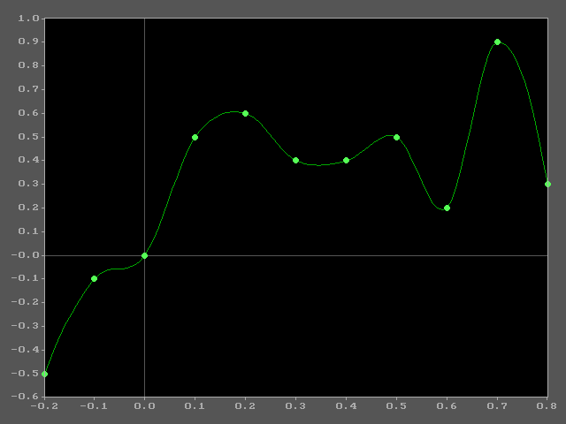
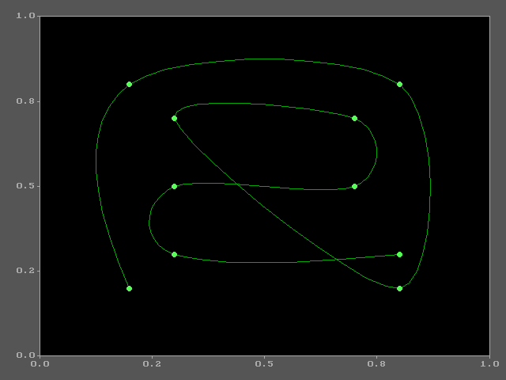

# Cubic Polynomial Curve Fitting Library


A piece-wise cubic Hermite spline library for interpolating smooth curves through a set of sample points.

Written in C++ for DOS. Compiled with Borland Turbo C++ 3.1, using the large memory model with far-heap allocation.

<div align="center">
  
  &emsp;&emsp;
  
  <br>
  <em>f&nbsp;</em>(<em>&nbsp;x&nbsp;</em>)&nbsp;=&nbsp;<em>y</em>
  &emsp;&emsp;&emsp;&emsp;&emsp;&emsp;&emsp;&emsp;&emsp;&emsp;&emsp;&emsp;&emsp;&emsp;&emsp;&emsp;&emsp;&emsp;&emsp;&emsp;&emsp;&emsp;
  <em>f&nbsp;</em>(<em>&nbsp;t&nbsp;</em>)&nbsp;=&nbsp;(&nbsp;<em>x</em>,&nbsp;<em>y</em>&nbsp;)
</div>

## 📑 Table of Contents

- [✨ Features](#-features)
- [📐 Math](#-math)
- [🧪 Running the Tests](#-running-the-tests)
- [🔨 Building from Source](#-building-from-source)
- [📁 Project Structure](#-project-structure)
- [🔬 Technical Details](#-technical-details)
- [📜 License](#-license)

## ✨ Features

- Piece-wise cubic Hermite spline interpolation through arbitrary sample points.
- Automatic slope estimation via central finite differences.
- Manual slope override for imposing tangent constraints at individual points.
- First derivative evaluation across the full interpolated domain.
- Quadratic end-segment handling where boundary points lack two-sided neighbors.
- Coordinate shifting to reduce coefficient magnitude and improve numerical stability.
- Far-heap memory allocation (`farmalloc`/`farfree`) for the large memory model.
- 2D parametric curve fitting via independent component splines.
- Data-driven configuration through INI settings files and CSV sample data.
- Configurable BGI line chart rendering with axis ranges, colours, tick marks, and multi-series overlay.

## 📐 Math

### Problem Statement

Given an ordered set of $N$ sample points $\lbrace (x_i,\, y_i) \rbrace_{i=0}^{N-1}$ with $x_0 < x_1 < \cdots < x_{N-1}$, construct a piece-wise polynomial interpolant $S(x)$ such that $S(x_i) = y_i$ for all $i$, with continuous first derivatives across segment boundaries.

### Slope Estimation

Prior to constructing the interpolating polynomials, a first derivative $D_i$ is estimated at each sample point using finite-difference approximations.

For interior points $(1 \leq i \leq N{-}2)$, a central difference is employed:

$$D_i = \frac{y_{i+1} - y_{i-1}}{x_{i+1} - x_{i-1}}$$

For the boundary points, one-sided differences are used:

$$D_0 = \frac{y_1 - y_0}{x_1 - x_0}\,, \qquad D_{N-1} = \frac{y_{N-1} - y_{N-2}}{x_{N-1} - x_{N-2}}$$

Individual slopes may be overridden manually after automatic estimation, allowing the caller to impose specific tangent constraints (e.g., forcing $D_i = 0$ at known turning points).

### Interior Segments — Cubic Hermite Interpolation

For each interior segment over the interval $[x_0,\, x_1]$, the interpolant is expressed in the monomial basis as:

$$f(x) = a x^3 + b x^2 + c x + d$$

The four unknown coefficients are uniquely determined by the Hermite interpolation conditions — two function-value constraints and two first-derivative constraints:

$$f(x_0) = y_0\,, \quad f(x_1) = y_1\,, \quad f'(x_0) = D_0\,, \quad f'(x_1) = D_1$$

These yield the $4 \times 4$ linear system:

```math
\begin{pmatrix}
x_0^3 & x_0^2 & x_0 & 1 \\
x_1^3 & x_1^2 & x_1 & 1 \\
3x_0^2 & 2x_0 & 1 & 0 \\
3x_1^2 & 2x_1 & 1 & 0
\end{pmatrix}
\begin{pmatrix}
a \\
b \\
c \\
d
\end{pmatrix}
=
\begin{pmatrix}
y_0 \\
y_1 \\
D_0 \\
D_1
\end{pmatrix}
```


The system admits a closed-form solution. All four coefficients share the common denominator:

$$\Delta = (x_1 - x_0)^3$$

The first derivative of the interpolant is obtained analytically:

$$f'(x) = 3a x^2 + 2b x + c$$

### Boundary Segments — Quadratic Interpolation

At the domain boundaries, where only one adjacent interior slope is available, the interpolant is reduced to a quadratic polynomial:

$$f(x) = a x^2 + b x + c$$

**First segment** $[x_0,\, x_1]$ — constrained by function values at both endpoints and the first derivative at the right (interior-facing) endpoint:

$$f(x_0) = y_0\,, \quad f(x_1) = y_1\,, \quad f'(x_1) = D_1$$

**Last segment** $[x_{N-2},\, x_{N-1}]$ — constrained by function values at both endpoints and the first derivative at the left (interior-facing) endpoint:

$$f(x_0) = y_0\,, \quad f(x_1) = y_1\,, \quad f'(x_0) = D_0$$

In both cases, the three constraints determine a $3 \times 3$ linear system with common denominator:

$$\Delta = (x_1 - x_0)^2$$

The first derivative is:

$$f'(x) = 2a x + b$$

### Numerical Stability

Prior to polynomial evaluation, each segment's endpoints are translated toward the origin. For a segment $[x_0,\, x_1]$ where both endpoints are non-negative, the substitution $x \mapsto x - x_0$ is applied, yielding the translated interval $[0,\, x_1 - x_0]$. An analogous shift is applied when both endpoints are non-positive. This translation reduces the magnitude of the monomial terms $x^k$ and thereby mitigates loss of significance due to catastrophic cancellation in the coefficient arithmetic.


## 🧪 Running the Tests

The pre-compiled `TEST-1.EXE` and `TEST-2.EXE` are included in the [Releases](../../releases) section. They are 16-bit DOS executables and require a DOS or DOS emulated environment to run. They have been tested in DOSBox.

### Using DOSBox

1. Install [DOSBox](https://www.dosbox.com/) or [DOSBox-X](https://dosbox-x.com/).
2. Download the latest release and extract it, preserving the directory structure. The layout should be:
   ```
   test\TEST-1.EXE
   test\TEST-2.EXE
   test\config-1.ini
   test\config-2.ini
   test\data-1.csv
   test\data-2.csv
   BGI\EGAVGA.BGI
   BGI\*.CHR
   ```
3. Launch DOSBox and mount the parent folder:
   ```
   mount c c:\path\to\your\folder
   c:
   cd test
   ```
4. Run a test program:
   ```
   test-1 data-1.csv
   ```
   or:
   ```
   test-2 data-2.csv
   ```
5. Press any key to exit and return to DOS.

### Using DOSBox-X or 86Box

Any DOS-compatible emulator that supports VGA 640x480 graphics will work. Mount the directory containing the release files (preserving the `test\` and `BGI\` directory structure), navigate to the `test\` directory, and run `TEST-1` or `TEST-2`.

## 🔨 Building from Source

Building requires **Borland Turbo C++ 3.1** (`BCC.EXE`) running inside DOSBox. The compiler is a 16-bit DOS program and cannot run on a modern OS directly.

### Prerequisites

- [DOSBox](https://www.dosbox.com/) (or DOSBox-X, but I have only tested in DOSBox)
- Borland Turbo C++ 3.1 installed and accessible from within DOSBox

### Build Steps

1. Mount both the Borland compiler directory and the project source directory in DOSBox.
2. Ensure `BCC.EXE` is on the DOS `PATH`.
3. Navigate to the `test\` directory and run the build script:
   ```
   cd test
   build
   ```
   This compiles seven library source files (`curve.cpp`, `ini.cpp`, `list.cpp`, `queue.cpp`, `stack.cpp`, `csv.cpp`, `graph.cpp`) from the `src\` directory into object files, then compiles each test program and links it with the library objects and the BGI `GRAPHICS.LIB` to produce `TEST-1.EXE` and `TEST-2.EXE`.

### Compiler Flags

| Flag  | Purpose                                                                |
|-------|------------------------------------------------------------------------|
| `-ml` | Large memory model (required for far pointers and far-heap allocation) |
| `-I..\src`| Include path for library headers in the `src\` directory            |

### Build Notes

- All source filenames follow the DOS 8.3 naming convention.
- `clean.bat` removes build artifacts (`.OBJ` and `.EXE` files, and `BUILD.LOG`) from the `test\` directory.
- The BGI driver path is loaded at runtime from the INI configuration file (`bgi_path` key in the `[global]` section).
- Build output is logged to `test\BUILD.LOG`.

## 📁 Project Structure

```
Polynomial-Curve-Fitting-Library
├─ src\
│  ├─ curve.h / curve.cpp        Spline library. Class declarations and implementation for Curve, Cubic, Bezier
│  ├─ list.h / list.cpp          Doubly-linked list container (ListDouble). Far-heap node allocation
│  ├─ queue.h / queue.cpp        Queue container (QueueDouble). FIFO wrapper extending ListDouble
│  ├─ stack.h / stack.cpp        Stack container (StackDouble). LIFO wrapper extending ListDouble
│  ├─ csv.h / csv.cpp            CSV file reader (CSVFile). 2-column and 3-column loaders
│  ├─ ini.h / ini.cpp            INI file parser (INI). Sections, key-value pairs, comments
│  └─ graph.h / graph.cpp        BGI line chart renderer (Graph). Configurable axes, colours, tick marks
│
├─ BGI\
│  ├─ EGAVGA.BGI                 Borland BGI graphics driver for VGA
│  └─ *.CHR                      Borland BGI stroked font files
│
├─ images\capture\               DOSBox screen captures
│
└─ test\
   ├─ build.bat                  Build script for BCC (run from test\ directory)
   ├─ clean.bat                  Removes build artifacts
   ├─ test-1.cpp                 Test program 1. Plots a cubic spline through CSV sample data
   ├─ test-2.cpp                 Test program 2. 2D parametric curve fitting from (t, x, y) CSV data
   ├─ config-1.ini               INI settings for test-1 (graph style, axis ranges, BGI path)
   ├─ config-2.ini               INI settings for test-2
   ├─ data-1.csv                 2-column sample data (x, y) for test-1
   ├─ data-2.csv                 3-column sample data (t, x, y) for test-2
   ├─ RUN1.BAT                   Runs test-1 with data-1.csv
   └─ RUN2.BAT                   Runs test-2 with data-2.csv
```

## 🔬 Technical Details

### Class Hierarchy

Three classes form the core curve fitting library, declared in `curve.h` and implemented in `curve.cpp`:

| Class | Description |
|---|---|
| `Curve` | Base class providing low-level spline primitives. Implements `CubicSpline`, `QuadraticSplineFirstSegment` (right-derivative constraint), `QuadraticSplineLastSegment` (left-derivative constraint), and their corresponding first-derivative methods. |
| `Cubic` | Fully implemented piece-wise cubic Hermite spline. `Init()` loads sample points into far-heap allocated storage. `AutoSlopes()` estimates derivatives via central finite differences. `f(x)` evaluates the interpolated curve. `d(x)` evaluates the first derivative. Accessors `GetX()`, `GetY()`, `GetSlope()` retrieve per-point data. `ModifySlope()` and `ResetSlopes()` allow manual slope adjustments. Each sample point stores `[x, y, slope]` in `p[i][0..2]`. |
| `Bezier` | Declared with tension control methods (`SetCurveTension`, `SetPointTension`) but stub-only. All methods are empty no-ops, reserved for future implementation. |

### Support Libraries

| Class | Description |
|---|---|
| `ListDouble` | Doubly-linked list container for `double` values. Uses `farmalloc`/`farfree` for node allocation. Provides indexed access, head/tail insertion and deletion, search, modify, and delete-all operations. |
| `QueueDouble` | Queue (FIFO) wrapper extending `ListDouble`. Provides `Enqueue()`, `Dequeue()`, and `QueueLength()`. |
| `StackDouble` | Stack (LIFO) wrapper extending `ListDouble`. Provides `Push()` and `Pop()`. |
| `CSVFile` | Reads CSV files with a header row into `ListDouble` containers. Supports 2-column `(x, y)` and 3-column `(a, b, c)` formats. |
| `INI` | Reads INI configuration files with `[section]` headers, `key = value` pairs, and `;` comment lines. Stores up to 32 entries with string values retrieved by section and key. |
| `Graph` | BGI line chart renderer. Plots data from `ListDouble` pairs with configurable axis ranges, colours, tick marks, margins, origin axes, and data point/line styling. Supports overlaying multiple data series via a `PlotCount` state that skips background/axis rendering on subsequent calls. |

### Interpolation Method

The spline evaluation in `Cubic::f()` works as follows:

1. **Segment Search** — Locates the interval `[x[i-1], x[i]]` enclosing the query point by linear scan through sorted sample points.
2. **Coordinate Shift** — Translates interval endpoints toward the origin to reduce coefficient magnitude and improve numerical precision.
3. **Polynomial Evaluation** — Delegates to the appropriate interpolation routine:
   - `CubicSpline` for interior segments (both endpoint slopes available).
   - `QuadraticSplineFirstSegment` for the first segment (right-endpoint slope only).
   - `QuadraticSplineLastSegment` for the last segment (left-endpoint slope only).

### Test Programs

| Program | Description |
|---|---|
| `test-1` | **Test Case:** $f(x) = y$<br>**Test Data:** `data-1.csv`<br>**Configuration Files:** `config-1.ini`<br><br>Loads 2-column sample data `(x, y)` from a CSV file, fits a piece-wise cubic spline, generates interpolated points between each pair of samples, and plots the fitted curve with original sample points overlaid. |
| `test-2` | **Test Case:** $f(t) = (x, y)$<br>**Test Data:** `data-2.csv`<br>**Configuration Files:** `config-2.ini`<br><br>2D parametric curve fitting. Loads 3-column sample data `(t, x, y)` from a CSV file, fits two independent splines $f_0(t) = x$ and $f_1(t) = y$, generates interpolated `(x, y)` points, and plots the resulting parametric curve with sample points overlaid. |

Both use Borland BGI `initgraph()` in VGA/VGAHI mode (640x480, 16-color). The CSV file name can be overridden via a command-line argument.

## 📜 License

Released under the [MIT License](LICENSE) — Copyright © 1998 Rohin Gosling.
